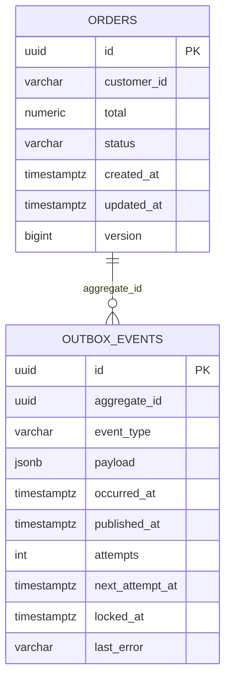
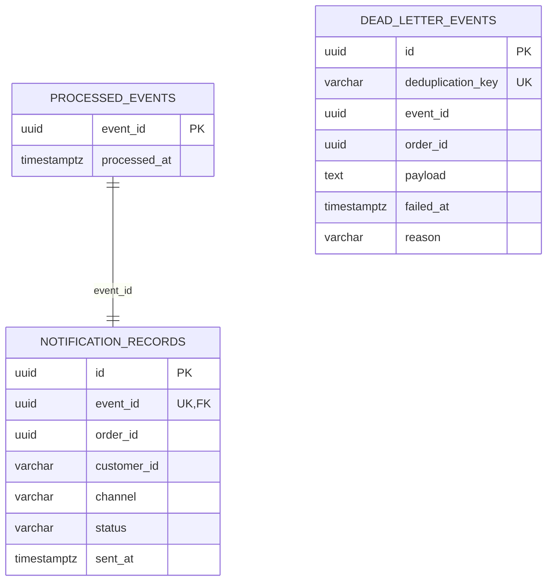

# OrderFlow Platform — Architecture

## 1. Contexto e objetivos

OrderFlow processa a criação de pedidos e uma notificação derivada sem acoplar a latência ou a disponibilidade do consumidor ao request HTTP. O sistema precisa tolerar broker indisponível, redelivery, múltiplas réplicas, reinício no meio do fluxo e eventos irrecuperáveis.

Os objetivos arquiteturais são:

- pedido aceito nunca depender de um dual write frágil;
- evento durável mesmo quando Kafka está fora;
- efeito do consumidor executado no máximo uma vez por `eventId` dentro do banco de notificações;
- falha de um pedido não bloquear a partition principal indefinidamente;
- configuração e telemetria adequadas a containers;
- desenho pequeno o suficiente para ser explicado e operado.

## 2. Bounded contexts e ownership

### order-service

É dono de:

- API de pedidos;
- regras de validação e transição de status;
- tabelas `orders` e `outbox_events`;
- cache Redis de leitura;
- publicação de `OrderCreatedEvent`.

Somente esse serviço altera `orders`. Redis é uma projeção descartável e nunca fonte de verdade.

### notification-service

É dono de:

- consumo de `OrderCreatedEvent`;
- tabela de idempotência `processed_events`;
- efeito simulado em `notification_records`;
- auditoria local de DLT em `dead_letter_events`;
- endpoint de consulta da notificação.

Ele não lê o banco do `order-service` e não faz chamada síncrona ao produtor. O evento carrega os dados mínimos necessários.

## 3. Fluxo de sucesso

```mermaid
sequenceDiagram
    autonumber
    participant C as Client
    participant O as order-service
    participant OP as Order PostgreSQL
    participant P as Outbox publisher
    participant K as Kafka
    participant N as notification-service
    participant NP as Notification PostgreSQL

    C->>O: POST /orders
    O->>O: validate + UUID + CREATED
    O->>OP: BEGIN
    O->>OP: INSERT orders
    O->>OP: INSERT outbox_events
    O->>OP: COMMIT
    O-->>C: 201 Created

    loop every 500 ms
        P->>OP: SELECT pending FOR UPDATE SKIP LOCKED
        P->>OP: set locked_at + COMMIT
    end
    P->>K: publish order.created (key=orderId)
    K-->>P: broker ACK
    P->>OP: set published_at

    K->>N: deliver record
    N->>NP: BEGIN
    N->>NP: INSERT processed_events ON CONFLICT DO NOTHING
    N->>NP: INSERT notification_records
    N->>NP: COMMIT
    N-->>K: listener returns; offset can advance
```

O `201` significa que o pedido e a intenção de publicar foram persistidos. Não significa que o consumer já processou o evento.

## 4. Limites transacionais

| Operação | Transação | Garantia |
|---|---|---|
| Criar pedido | `orders` + `outbox_events` | ambos commitam ou ambos sofrem rollback |
| Reivindicar Outbox | select lock + `locked_at` | uma réplica reivindica cada linha durante a janela de lock |
| Publicar Kafka | fora da transação DB | espera ACK, mas não é atomicamente ligado ao update DB |
| Marcar Outbox | `published_at` ou falha/backoff | estado durável para próximo polling |
| Processar evento | `processed_events` + `notification_records` | claim e efeito commitam juntos |
| Registrar DLT | insert com chave de deduplicação | redelivery da própria DLT não duplica auditoria |
| Atualizar status/cache | update JPA + eviction transaction-aware | eviction Redis só é efetivada após commit bem-sucedido |

O código separa `OutboxPublisher` de `OutboxStateService` para que os métodos `@Transactional` sejam chamados por outro bean e passem pelo proxy Spring. O listener chama `NotificationProcessor` e `DeadLetterRecorder` pelo mesmo motivo.

## 5. Transactional Outbox em detalhe

### Escrita

`OrderCommandService.create` constrói `OrderEntity` e `OrderCreatedEvent`, serializa o evento e salva ambos dentro do mesmo `@Transactional`. A migration define o payload como `JSONB`, preservando o contrato que será publicado.

Se a serialização ou o insert da Outbox falhar, o pedido não é confirmado. Se Kafka estiver indisponível, isso não afeta o request já persistido; o publisher tenta depois.

### Claim concorrente

O publisher seleciona no máximo 50 linhas:

```sql
SELECT *
FROM outbox_events
WHERE published_at IS NULL
  AND next_attempt_at <= :now
  AND (locked_at IS NULL OR locked_at < :expired)
ORDER BY occurred_at
LIMIT :batchSize
FOR UPDATE SKIP LOCKED;
```

Durante a transação, `locked_at` recebe o instante atual. Outra réplica ignora locks de linha ainda abertos e, após o commit, vê `locked_at` não expirado. Um processo morto deixa o lock lógico expirar em 30 segundos.

O send timeout é 5 segundos, deliberadamente menor que o lock timeout. Isso reduz a chance de uma segunda réplica reivindicar enquanto a primeira ainda aguarda ACK.

### Falhas e backoff

Falha de publicação mantém `published_at = NULL`, incrementa `attempts`, libera `locked_at` e define:

```text
nextAttemptAt = now + min(1 segundo × 2^attempts, 1 minuto)
```

Não existe limite que descarte a Outbox. Uma indisponibilidade longa deve gerar alerta por idade/volume de pendências, não perda silenciosa.

### Janela inevitável de duplicata

Se Kafka confirma o send e o processo morre antes do update de `published_at`, a linha é publicada novamente após o lock expirar. Isso é preferível a marcar antes do ACK, que poderia perder eventos. O sistema resolve o caso com `eventId` idempotente no consumidor.

## 6. Kafka

### Topics

- `order.created`: três partitions, evento original;
- `order.created.retry-0`: primeira retentativa;
- `order.created.retry-1`: segunda retentativa;
- `order.created.dlt`: tentativas esgotadas ou falha não recuperável.

Todos usam replication factor 1 no ambiente local. Produção precisa de múltiplos brokers e replication factor adequado.

### Key e ordering

`orderId` é a key. Kafka aplica o hash da key para escolher uma partition; todos os registros desse pedido no mesmo topic permanecem ordenados. O paralelismo é entre pedidos em partitions diferentes.

O retry não bloqueante move registros para outros topics. Portanto, um evento em retry pode ser ultrapassado por outro evento posterior da mesma key no topic principal. Esse trade-off está explícito. Como este projeto publica somente a criação, não há transição posterior dependente dessa ordem no consumer.

### Consumer group e offsets

O group principal é `notification-service-v1`. Três partitions e concurrency três permitem três threads/réplicas ativas; instâncias excedentes ficam sem assignment. Spring cria groups derivados para retry/DLT, evitando que um rebalance de retry obrigue o listener principal a rebalancear.

`enable-auto-commit=false` e ack mode `RECORD` fazem o offset avançar depois do retorno bem-sucedido do listener. Offset não é confirmação de efeito exactly-once; ele é posição do group.

### Contrato versionado

O producer e consumer possuem seus próprios records Java em seus serviços. Não há JAR compartilhado. Isso permite deploy independente e força compatibilidade no wire contract. `eventVersion` aceita hoje apenas `1`; uma nova versão deve ser aditiva ou acompanhada de consumer compatível antes do producer.

## 7. Idempotência do consumidor

O algoritmo é:

```text
BEGIN
  INSERT processed_events(event_id) ON CONFLICT DO NOTHING
  if inserted == 0:
      COMMIT and return DUPLICATE

  simulate provider
  INSERT notification_records(event_id unique)
COMMIT
```

A chave primária em `processed_events.event_id` decide atomicamente entre duas threads concorrentes. Não existe sequência `exists` seguida de `insert`, que teria race condition.

A falha controlada acontece depois do claim. A exceção causa rollback, removendo o claim; o próximo retry pode processar novamente. Após sucesso, um crash antes do offset commit leva a redelivery, mas o insert retorna zero e o efeito não se repete.

O efeito de demo é uma linha PostgreSQL, então participa da mesma transação. Para e-mail/SMS real, a fronteira mudaria: um outgoing Outbox local ou idempotency key do provedor seria necessário.

## 8. Retry e DLT

Spring Kafka implementa retry topics não bloqueantes. A configuração usa três attempts totais, delay inicial 1 segundo, multiplicador 2 e máximo 5 segundos. `InvalidOrderCreatedEventException` é excluída do retry porque JSON inválido, versão desconhecida ou key incorreta não melhoram com tempo.

`DltStrategy.FAIL_ON_ERROR` evita republicar indefinidamente na própria DLT se o handler falhar. Como o handler grava em PostgreSQL, uma indisponibilidade desse banco impede o commit/offset e permite redelivery do mesmo registro DLT sem criar um ciclo DLT → DLT.

`dead_letter_events.deduplication_key` é `UNIQUE`. Eventos válidos usam `eventId`; payloads ilegíveis usam SHA-256. A DLT continua existindo no Kafka; a tabela é uma visão operacional consultável.

## 9. Redis

O cache-aside é implementado pela abstração Spring Cache:

```text
GET -> Redis hit -> response
GET -> Redis miss -> PostgreSQL -> JSON in Redis -> response
PATCH status -> PostgreSQL commit -> evict Redis key
```

TTL de 10 minutos limita staleness e memória. O serializer `JacksonJsonRedisSerializer<OrderResponse>` evita Java native serialization e payload polimórfico inseguro. `null` não é cacheado.

Pedidos não são colocados no cache durante POST. Essa escolha mantém o caminho de escrita independente de Redis; a primeira leitura preenche o cache. Se Redis estiver indisponível, por padrão a leitura falha em vez de mascarar um problema de infraestrutura. Uma política de fallback poderia ser adicionada se disponibilidade de leitura justificasse aceitar maior pressão no banco.

## 10. Modelo de dados

### Order database



Não há foreign key física da Outbox para o aggregate. A Outbox é log técnico e pode sobreviver a mudanças de retenção do aggregate.

### Notification database



## 11. Matriz de falhas

| Falha | Comportamento | Recuperação |
|---|---|---|
| PostgreSQL fora no POST | request falha; nada persiste | client retenta conforme política própria |
| Kafka fora após POST | pedido e Outbox permanecem | publisher usa backoff até Kafka voltar |
| Crash antes do commit do pedido | rollback completo | request pode ser repetido, gerando novo pedido |
| Crash após Kafka ACK e antes de `published_at` | possível publicação duplicada | idempotência no consumer |
| Consumer falha antes do commit DB | rollback, offset não avança no fluxo atual | retry topic |
| Crash após commit DB e antes do offset | redelivery | claim retorna duplicata e nenhum efeito novo |
| Evento inválido | sem retry inútil | DLT + tabela auditável |
| Falha persistente controlada | dois retries | DLT; consumer continua com outros registros |
| Redis fora | GET cacheado falha | health/readiness sinaliza; restaurar Redis |
| Réplica Outbox morre com linha claimed | `locked_at` fica | outra réplica recupera após 30 s |

## 12. Escalabilidade

- `order-service`: réplicas horizontais; Outbox coordena via PostgreSQL.
- `notification-service`: escala até o número de partitions por group; mais partitions aumentam paralelismo futuro.
- PostgreSQL: pool limitado por instância; somar pools antes de escalar réplicas.
- Redis: cache compartilhado mantém coerência de eviction entre réplicas da API.
- Kafka: ambiente de produção deve separar brokers/controllers conforme topologia e usar replication factor maior.
- Outbox: índice parcial limita a busca às linhas pendentes. Volume muito alto justificaria particionamento/retention ou CDC.

## 13. Observabilidade

### Métricas

Actuator expõe métricas JVM/processo, Hikari, HTTP, cache e Kafka. Contadores de domínio tornam falhas e resultados diretamente alertáveis. Prometheus faz pull a cada 10 segundos; Grafana é provisionado por arquivo.

Alertas de produção recomendados:

- idade da linha Outbox pendente mais antiga;
- taxa de falha Outbox;
- consumer lag;
- crescimento/entrada na DLT;
- taxa HTTP 5xx e p95/p99;
- saturation do Hikari;
- heap/GC;
- readiness indisponível.

O contador existe, mas a idade da Outbox ainda não é exportada como gauge para evitar query ao banco em todo scrape. Uma tarefa periódica poderia calcular esse valor em cache.

### Tracing

Spring MVC produz spans HTTP. KafkaTemplate e listener têm observation habilitada e propagam W3C pelos headers. O OTel Collector recebe OTLP/HTTP e exporta para Tempo.

A fronteira Outbox quebra a trace HTTP original porque o contexto não é persistido no evento técnico. O span do publisher inicia uma nova trace que continua no consumer. Persistir `traceparent` na Outbox seria possível, mas também prolongaria artificialmente uma trace por tempo indefinido durante indisponibilidade; spans links ou correlation pelo `eventId` podem ser alternativas melhores.

### Logs

Spring Boot emite JSON Logstash. Trace/span IDs entram no MDC. Logging fluente adiciona campos pesquisáveis sem interpolar payloads ou segredos.

## 14. Segurança

- credenciais só por environment variables/Secret;
- containers não-root;
- DTOs e validação de fronteira;
- Problem Details sem stack trace;
- serializers String/JSON explícitos e sem trusted packages arbitrários;
- nenhuma desserialização Java nativa no Redis;
- sem acesso cruzado a databases;
- probes separadas de endpoints de negócio.

Fora do escopo atual: autenticação OIDC, TLS/mTLS interno, Kafka SASL, network policies e criptografia de secrets em Git. Esses itens são obrigatórios antes de produção pública.

## 15. Ambientes

### Docker Compose

Topologia completa de desenvolvimento, inclusive observabilidade. Kafka single-node e credenciais locais.

### Kubernetes local

Manifests didáticos com duas réplicas de aplicação, probes e recursos. Infra stateful simplificada; tracing export desabilitado até um Collector ser instalado. O Secret real é criado pelo operador e não pelo Kustomization.

### AWS sugerida

ECS/Fargate ou EKS, RDS, MSK, ElastiCache, ECR, Secrets Manager e ADOT/CloudWatch/Managed Prometheus. A escolha entre ECS e EKS é organizacional; a aplicação não depende de APIs específicas AWS.

## 16. Decisões rejeitadas

### Publicar Kafka dentro do mesmo método sem Outbox

Falha entre DB e Kafka produziria pedido sem evento ou evento de transação posteriormente revertida.

### Transação distribuída/2PC

Acoplamento operacional e disponibilidade não se justificam; Kafka e PostgreSQL não formam uma transação XA simples no stack escolhido.

### Redis para idempotência crítica

O efeito e a deduplicação precisam commitar juntos. PostgreSQL oferece essa atomicidade; Redis criaria outro dual write.

### Exactly-once como slogan

Kafka EOS pode tratar read-process-write dentro de Kafka, mas não torna uma escrita PostgreSQL e uma notificação externa exatamente uma vez. O projeto declara garantias reais.

### Banco compartilhado

Facilitaria joins, mas quebraria ownership e permitiria acoplamento de schema entre serviços.

### Dezenas de interfaces e camadas

Classes concretas e pacotes por responsabilidade bastam. Interfaces só aparecem onde Spring Data as implementa.

## 17. Evolução segura

1. Adicionar campo opcional ao evento v1 quando consumers antigos puderem ignorá-lo.
2. Para breaking change, introduzir v2 e fazer o consumer aceitar v1/v2 antes do producer emitir v2.
3. Medir Outbox e lag antes de aumentar partitions ou batch.
4. Se o provider externo for real, implementar outgoing Outbox/idempotency key antes de remover a simulação.
5. Definir retenção de `processed_events`, Outbox publicada e DLT conforme retenção Kafka e possibilidade de replay.
