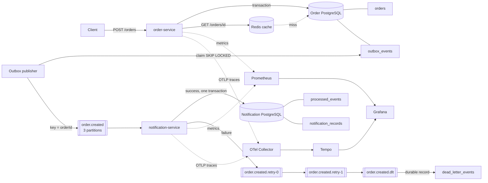

# OrderFlow Platform

OrderFlow Platform é uma plataforma backend orientada a eventos para receber pedidos, persistir seu estado e processar notificações de forma resiliente. O projeto é um monorepo Maven com dois microsserviços independentes, bancos PostgreSQL separados e integração assíncrona via Apache Kafka.

O foco não é quantidade de tecnologias. Cada componente trata um problema concreto: PostgreSQL mantém o estado durável, a Transactional Outbox remove o dual write ingênuo entre banco e Kafka, o consumidor idempotente tolera redelivery, Redis reduz leituras repetidas, retry topics isolam falhas sem bloquear a partição principal e a DLT preserva eventos esgotados para análise.

## 1. Visão geral e problema resolvido

O fluxo principal começa em `POST /orders`. O `order-service` valida o request, grava o pedido e o evento pendente na mesma transação PostgreSQL. Um publisher assíncrono reivindica lotes da Outbox com `FOR UPDATE SKIP LOCKED`, publica o JSON em `order.created` usando `orderId` como key e só depois marca o evento como publicado.

O `notification-service` consome o evento, tenta inserir o `eventId` em `processed_events` e grava a notificação simulada na mesma transação. Uma chave primária torna essa reivindicação atômica: redeliveries não repetem o efeito. Falhas passam por dois retry topics com backoff exponencial e, após três tentativas totais, chegam a `order.created.dlt`.

## 2. Arquitetura



Detalhes de limites transacionais, janelas de falha e escala estão em [ARCHITECTURE.md](ARCHITECTURE.md).

## 3. Tecnologias efetivamente usadas

| Área | Tecnologia | Uso real |
|---|---|---|
| Runtime | Java 21, Spring Boot 4.1.1 | APIs, serviços, configuração e Actuator |
| Persistência | PostgreSQL 17, Spring Data JPA, Flyway | Pedidos, Outbox, idempotência, notificações e DLT auditável |
| Eventos | Apache Kafka 4.1.2, Spring for Apache Kafka 4.1.1 | Producer, consumer, keys, partitions, offsets, retries e DLT |
| Cache | Redis 7.4 | Cache JSON de `GET /orders/{id}` com TTL e invalidação |
| Testes | JUnit, Mockito, MockMvc, Testcontainers 2.0.5, Awaitility | Unitários, API e integrações reais |
| Observabilidade | Actuator, Micrometer, OpenTelemetry, Prometheus 3.12, Tempo 2.10, Grafana 13.1 | Health, métricas, tracing, dashboard e logs JSON |
| Entrega | Maven, Docker multi-stage, Docker Compose, Kubernetes, GitHub Actions | Build repetível, ambiente local e CI |

## 4. Estrutura do projeto

```text
orderflow-platform/
├── order-service/
│   ├── src/main/java/.../api|application|config|domain|outbox
│   ├── src/main/resources/db/migration/
│   ├── src/test/java/
│   └── Dockerfile
├── notification-service/
│   ├── src/main/java/.../api|application|config|domain|event
│   ├── src/main/resources/db/migration/
│   ├── src/test/java/
│   └── Dockerfile
├── observability/
│   ├── grafana/
│   ├── otel-collector/
│   ├── prometheus/
│   └── tempo/
├── k8s/
├── scripts/
│   ├── smoke-test.ps1
│   └── smoke-test.sh
├── .github/workflows/ci.yml
├── docker-compose.yml
├── ARCHITECTURE.md
├── INTERVIEW_GUIDE.md
└── pom.xml
```

## 5. Como executar com Docker Compose

Pré-requisitos: Docker Engine/Desktop com Compose v2. O projeto não exige Kafka, PostgreSQL, Redis ou Maven instalados no host para esse modo.

Copie o exemplo e substitua os dois placeholders por senhas locais. O Compose rejeita a inicialização se elas não estiverem definidas:

```powershell
Copy-Item .env.example .env
```

Suba todo o ambiente:

```bash
docker compose up --build -d
docker compose ps
```

O Compose usa healthchecks, e os serviços Java aguardam PostgreSQL, Kafka, Redis e Collector ficarem saudáveis. Não há `sleep` de inicialização.

Verifique os serviços:

```bash
curl http://localhost:8080/actuator/health/readiness
curl http://localhost:8081/actuator/health/readiness
```

No Windows, o fluxo saudável completo pode ser exercitado com:

```powershell
./scripts/smoke-test.ps1
```

Em Linux, incluindo o runner do GitHub Actions, a validação distribuída completa usa:

```bash
bash scripts/smoke-test.sh
```

Esse script pressupõe que o Compose já esteja saudável e valida migrations, APIs, bancos, Outbox, Kafka, Redis, idempotência, retry/DLT e componentes de observabilidade.

Para encerrar preservando os volumes:

```bash
docker compose down
```

Para também apagar dados locais, execute conscientemente `docker compose down -v`.

## 6. Endpoints e exemplos

### Criar pedido

```bash
curl -i -X POST http://localhost:8080/orders \
  -H "Content-Type: application/json" \
  -d '{"customerId":"customer-123","total":150.50}'
```

Resposta `201 Created`, com header `Location`:

```json
{
  "id": "7dd92ed8-6a9a-4d61-a4c5-8a67a6ab6020",
  "customerId": "customer-123",
  "total": 150.50,
  "status": "CREATED",
  "createdAt": "2026-08-24T18:00:00Z",
  "updatedAt": "2026-08-24T18:00:00Z"
}
```

Validações: `customerId` obrigatório com até 100 caracteres; `total` obrigatório, positivo e com até duas casas decimais. Dinheiro usa `BigDecimal` e PostgreSQL `NUMERIC(19,2)`.

### Consultar pedido

```bash
curl http://localhost:8080/orders/7dd92ed8-6a9a-4d61-a4c5-8a67a6ab6020
```

Retorna `404` em formato `application/problem+json` quando o UUID não existe.

### Atualizar status

```bash
curl -X PATCH http://localhost:8080/orders/7dd92ed8-6a9a-4d61-a4c5-8a67a6ab6020/status \
  -H "Content-Type: application/json" \
  -d '{"status":"PROCESSING"}'
```

Transições permitidas:

```text
CREATED -> PROCESSING -> COMPLETED
   |             |
   +----------> CANCELLED
```

Transições inválidas retornam `409 Conflict`. A entidade usa optimistic locking (`@Version`).

### Consultar notificação processada

```bash
curl http://localhost:8081/notifications/orders/7dd92ed8-6a9a-4d61-a4c5-8a67a6ab6020
```

Esse endpoint pequeno existe para tornar a integração assíncrona verificável. Retorna `404` enquanto a notificação ainda não foi gravada.

## 7. Kafka: evento, partitions, groups e offsets

O contrato JSON `OrderCreatedEvent` possui:

```json
{
  "eventId": "449d7c2c-0c24-472a-973f-dda399ecee80",
  "eventVersion": 1,
  "occurredAt": "2026-08-24T18:00:00Z",
  "orderId": "7dd92ed8-6a9a-4d61-a4c5-8a67a6ab6020",
  "customerId": "customer-123",
  "total": 150.50
}
```

- `eventVersion = 1` permite evolução explícita; versões não suportadas vão direto à DLT.
- `eventId` identifica uma ocorrência e é a chave de idempotência.
- `orderId` é a Kafka key, portanto eventos do mesmo pedido permanecem na mesma partition.
- `order.created` tem três partitions. O consumer usa concorrência três e group `notification-service-v1`, permitindo até três consumers ativos em paralelo.
- Cada consumer confirma o offset somente após o método retornar. Se o processo cair depois do commit PostgreSQL e antes do commit do offset, Kafka entrega novamente; a deduplicação trata isso.

Inspecione topics e groups:

```bash
docker compose exec kafka /opt/kafka/bin/kafka-topics.sh \
  --bootstrap-server kafka:19092 --describe --topic order.created

docker compose exec kafka /opt/kafka/bin/kafka-consumer-groups.sh \
  --bootstrap-server kafka:19092 --describe --group notification-service-v1
```

## 8. Transactional Outbox

Gravar um pedido e publicar Kafka são operações em sistemas diferentes. Uma transação JPA não pode torná-las atomicamente uma única operação sem coordenação distribuída. A implementação evita o dual write desta forma:

1. `orders` e `outbox_events` são gravados na mesma transação PostgreSQL.
2. O publisher busca eventos vencidos e não publicados.
3. `FOR UPDATE SKIP LOCKED` e `locked_at` impedem duas réplicas de reivindicarem o mesmo lote.
4. O publisher espera o ACK do broker e marca `published_at` em nova transação.
5. Falhas incrementam `attempts`, registram `last_error` e calculam backoff exponencial limitado a um minuto.
6. Locks abandonados expiram após 30 segundos.

Se a aplicação cair depois do ACK Kafka e antes de atualizar `published_at`, o evento pode ser publicado novamente. Isso é intencional: a Outbox oferece entrega **at-least-once**, e o consumidor idempotente fecha essa janela sem apagar eventos silenciosamente.

## 9. Idempotência e at-least-once

Kafka pode redeliver quando há rebalance, retry, timeout de ACK ou crash entre o efeito externo e o commit do offset. O `notification-service` usa uma transação PostgreSQL:

```sql
INSERT INTO processed_events (event_id, processed_at)
VALUES (?, ?)
ON CONFLICT (event_id) DO NOTHING;
```

Se uma linha é inserida, a mesma transação grava `notification_records`. Se já existe, o evento é duplicado e não há novo efeito. Se a notificação simulada falhar, toda a transação — inclusive o claim — sofre rollback, permitindo uma tentativa posterior. `notification_records.event_id` também é `UNIQUE`, oferecendo defesa adicional.

Em um sistema que enviasse e-mail por API externa, seria necessário um segundo Outbox ou uma chave idempotente aceita pelo provedor; uma chamada HTTP externa não participa da transação PostgreSQL.

## 10. Retry e Dead Letter Topic

Configuração padrão:

| Tentativa | Topic | Backoff |
|---|---|---:|
| 1 | `order.created` | imediato |
| 2 | `order.created.retry-0` | 1 s |
| 3 | `order.created.retry-1` | 2 s |
| esgotada | `order.created.dlt` | — |

Os retry topics são não bloqueantes: o registro problemático sai do topic principal e não interrompe outros pedidos. O custo é perder a garantia de ordem relativa entre um registro em retry e registros posteriores da mesma key. Essa escolha é aceitável aqui porque existe apenas `OrderCreatedEvent`; workflows multi-evento exigiriam outra estratégia.

Eventos JSON inválidos, versões desconhecidas ou key diferente de `orderId` são não recuperáveis e seguem direto para a DLT. O handler grava de forma idempotente em `dead_letter_events`; para payloads sem `eventId`, usa SHA-256 do payload como chave de deduplicação.

### Reproduzir falha controlada

Qualquer `customerId` iniciado por `fail-dlt-` aciona a falha simulada:

```bash
curl -X POST http://localhost:8080/orders \
  -H "Content-Type: application/json" \
  -d '{"customerId":"fail-dlt-demo","total":99.90}'
```

Depois das tentativas, confira a DLT e o registro durável:

```bash
docker compose exec kafka /opt/kafka/bin/kafka-console-consumer.sh \
  --bootstrap-server kafka:19092 \
  --topic order.created.dlt --from-beginning --max-messages 1

docker compose exec notification-postgres psql -U orderflow -d notifications \
  -c "select event_id, failed_at, reason from dead_letter_events order by failed_at desc limit 5;"
```

Crie em seguida um pedido com `customerId` normal e consulte `/notifications/orders/{orderId}`. Isso demonstra que o consumer continuou saudável.

## 11. Redis

Redis é usado somente no `order-service` como cache de leitura:

- cache: `orders`;
- key efetiva: `orders::<orderId>`;
- valor: JSON tipado de `OrderResponse`, sem serialização Java nativa;
- TTL padrão: 10 minutos, configurável por `ORDER_CACHE_TTL`;
- primeiro GET: miss, consulta PostgreSQL e popula Redis;
- GET subsequente: hit, evita o banco;
- `PATCH /status`: invalida a key depois do commit transacional;
- resultados `null` e respostas 404 não são cacheados;
- política Redis local: `allkeys-lru`, limite 128 MiB.

Inspeção manual:

```bash
docker compose exec redis redis-cli KEYS 'orders::*'
docker compose exec redis redis-cli TTL 'orders::<orderId>'
```

As estatísticas locais do `RedisCacheManager` são habilitadas e podem aparecer nas métricas de cache do Actuator.

## 12. PostgreSQL e migrations

Cada serviço possui credencial, database e migration Flyway próprios. O Hibernate usa `ddl-auto=validate`, portanto não altera schema automaticamente.

Decisões relevantes:

- UUIDs como IDs públicos e de evento;
- `NUMERIC(19,2)` com `CHECK (total > 0)`;
- `TIMESTAMPTZ` e relógio UTC;
- constraints para status e strings vazias;
- índice parcial em Outbox pendente;
- índices de busca por pedido, `eventId` e data da DLT;
- `@Version` para concorrência otimista de pedidos;
- pools Hikari limitados e configuráveis.

## 13. Observabilidade

| Recurso | URL |
|---|---|
| Order health | <http://localhost:8080/actuator/health> |
| Notification health | <http://localhost:8081/actuator/health> |
| Order metrics | <http://localhost:8080/actuator/prometheus> |
| Notification metrics | <http://localhost:8081/actuator/prometheus> |
| Prometheus | <http://localhost:9090> |
| Grafana | <http://localhost:3000> |
| Tempo API | <http://localhost:3200> |

O dashboard `OrderFlow Overview` é provisionado automaticamente com request rate, p95, HTTP 5xx, Kafka listeners, Outbox, resultados de notificação e heap JVM.

Métricas de domínio:

- `orderflow.outbox.published` e `orderflow.outbox.failures`;
- `orderflow.notifications.attempts`;
- `orderflow.notifications.processed`;
- `orderflow.notifications.duplicates`;
- `orderflow.notifications.simulated_failures`;
- `orderflow.notifications.dlt`.

Spring MVC e Spring Kafka usam Micrometer Observation. O KafkaTemplate injeta contexto W3C nos headers, e o listener cria o span consumidor. O publisher da Outbox roda assíncrono, então a trace Kafka começa nele e continua no `notification-service`; a trace HTTP original não é ligada ao publisher porque o contexto de trace não é persistido na Outbox. Essa limitação é documentada em vez de fingir uma trace ponta a ponta que o código não produz.

Logs de console usam JSON Logstash nativo do Spring Boot. Pares estruturados incluem `eventId`, `orderId`, tentativa e resultado; `traceId`/`spanId` entram pelo MDC quando existe uma observação ativa. Payload completo e dados sensíveis não são logados.

## 14. Testes

Execute tudo:

```bash
mvn -B -ntp verify
```

Cobertura de valor:

- regras e transições de status;
- criação atômica de Order + Outbox;
- consulta e 404;
- validação e Problem Details da API;
- claim, backoff e estados da Outbox;
- ACK e falha do publisher;
- validação de versão e Kafka key;
- processamento idempotente e rollback em falha;
- persistência DLT;
- integração HTTP/PostgreSQL/Kafka/Redis;
- duplicata real via Kafka;
- retry/DLT real e saúde do consumer após DLT.

Os testes `*IT` usam PostgreSQL, Kafka e Redis reais via Testcontainers e são executados pelo Maven Failsafe. `disabledWithoutDocker=true` faz somente esses testes serem ignorados quando não há daemon; não há banco ou broker em memória fingindo a integração.

Na CI, uma etapa posterior ao `mvn verify` analisa os relatórios Failsafe e exige exatamente os três cenários de integração com `skipped=0`. Assim, indisponibilidade de Docker no runner não pode produzir um job aparentemente verde apenas porque o JUnit ignorou os Testcontainers.

Estado validado neste workspace em 24/08/2026:

- `mvn verify`: **BUILD SUCCESS**;
- 25 testes unitários: 25 passaram;
- 3 cenários Testcontainers: compilados, 3 ignorados por ausência de Docker;
- JAR executável dos dois serviços: gerado;
- YAMLs e dashboard JSON: parsing sintático concluído;
- containers e endpoints reais: não executados localmente porque o único `docker` disponível é um arquivo vazio, não um Docker Engine.

## 15. Docker

Os Dockerfiles usam build multi-stage, cache de dependências, JRE Java 21 separado, usuário não-root, limite de RAM relativo ao container e healthcheck de readiness. O contexto de build é a raiz porque ambos os módulos herdam o POM pai.

O Compose sobe:

- dois PostgreSQL independentes;
- Kafka single-node KRaft com listeners interno e externo;
- Redis;
- os dois serviços;
- OpenTelemetry Collector;
- Tempo;
- Prometheus;
- Grafana.

Single-node Kafka e databases locais privilegiam uma demo reproduzível, não alta disponibilidade. Produção requer múltiplos brokers/AZs e serviços gerenciados.

## 16. Kubernetes

A pasta `k8s/` contém Namespace, ConfigMap, Secret de exemplo, Services, Deployments, StatefulSets, probes, recursos e duas réplicas de cada aplicação. PostgreSQL usa PVC; Kafka e Redis usam armazenamento efêmero por simplicidade local.

Build e carregamento no Minikube:

```bash
docker build -f order-service/Dockerfile -t orderflow/order-service:local .
docker build -f notification-service/Dockerfile -t orderflow/notification-service:local .
minikube image load orderflow/order-service:local
minikube image load orderflow/notification-service:local
```

Crie o Secret fora do Kustomization para nunca aplicar os placeholders:

```bash
kubectl apply -f k8s/namespace.yml
kubectl -n orderflow create secret generic orderflow-secrets \
  --from-literal=ORDER_DB_PASSWORD='local-order-password' \
  --from-literal=NOTIFICATION_DB_PASSWORD='local-notification-password'
kubectl apply -k k8s
kubectl -n orderflow rollout status deployment/order-service
kubectl -n orderflow rollout status deployment/notification-service
kubectl -n orderflow port-forward service/order-service 8080:8080
```

O manifesto `secret.example.yml` é apenas um contrato com placeholders e não é referenciado por `kustomization.yml`. O tracing export está desabilitado no perfil local Kubernetes porque Collector/Tempo não fazem parte desses manifests; o Compose demonstra a topologia de tracing completa.

## 17. CI/CD

`.github/workflows/ci.yml` executa em push para `main` e pull requests, dividido em três responsabilidades:

1. `test`: Temurin Java 21, cache Maven, `mvn verify`, confirmação de três cenários Testcontainers sem skips e upload dos relatórios;
2. `docker-build`: build independente das imagens dos dois serviços com Buildx e cache GHA;
3. `e2e`: senhas PostgreSQL efêmeras, validação do Compose, `docker compose up -d --build --wait`, smoke test distribuído, diagnóstico em falha e teardown obrigatório.

Não existe deploy automático nem credencial de cloud. O princípio é verificar artefatos, não criar custo.

## Automated End-to-End Validation

A pipeline está preparada para executar no runner Linux do GitHub:

- testes unitários e de API;
- integrações reais com PostgreSQL, Kafka e Redis via Testcontainers;
- migrations Flyway e validação explícita de que os ITs não foram ignorados;
- build das duas imagens Docker;
- stack distribuída completa via Docker Compose;
- smoke test de POST/GET/PATCH, persistência, Outbox, Kafka, notificação, cache e invalidação;
- duplicação deliberada do mesmo `eventId` para provar idempotência;
- falha `fail-dlt-`, três tentativas, DLT auditável e processamento saudável posterior;
- health, métricas, Prometheus, Grafana, OpenTelemetry Collector e Tempo;
- logs como artifact em falha e `docker compose down -v --remove-orphans` em qualquer resultado.

Essa pipeline foi preparada e validada estaticamente neste workspace, mas ainda não se afirma execução bem-sucedida no GitHub Actions. A confirmação final depende do primeiro push e da execução do workflow em um runner com Docker.

## 18. Arquitetura AWS sugerida

| Local | AWS | Observação |
|---|---|---|
| Containers | ECS/Fargate ou EKS | ECS reduz operação; EKS faz sentido se Kubernetes já for padrão organizacional |
| PostgreSQL | RDS PostgreSQL Multi-AZ | Bancos lógicos/instâncias isolados conforme criticidade |
| Kafka | Amazon MSK | Múltiplos brokers e AZs; IAM/SASL e TLS |
| Redis | ElastiCache for Redis | Replication group, TLS e subnet privada |
| OTel Collector | Sidecar/daemon no ECS/EKS ou ADOT | Export para Tempo gerenciado, X-Ray ou outro backend OTLP |
| Métricas/logs | Managed Prometheus, Managed Grafana e CloudWatch | Retenção e alarmes centralizados |
| Secrets | Secrets Manager | Injeção em task/pod, sem Secret em Git |
| Imagens | ECR | Scan e tags imutáveis |
| Entrada | ALB + API Gateway opcional | TLS, WAF e rate limiting na borda |

Uma implantação segura adicionaria VPC privada, security groups mínimos, IAM por workload, backups/PITR, autoscaling, alertas e MSK/RDS/ElastiCache gerenciados. Nenhum recurso AWS ou Terraform é aplicado por este repositório.

## 19. Principais decisões técnicas

- Outbox em vez de transação distribuída ou dual write.
- Entrega at-least-once com consumidor idempotente, sem alegação de exactly-once fim a fim.
- Contratos duplicados por serviço, evitando um módulo Java compartilhado que acople deploys; compatibilidade é controlada por `eventVersion`.
- JSON String serializer/deserializer explícito: o payload armazenado na Outbox é exatamente o publicado.
- PostgreSQL para idempotência durável, pois o efeito também é PostgreSQL e cabe na mesma transação.
- Redis apenas como cache de leitura; não é fonte de verdade nem deduplicador crítico.
- Retry topics não bloqueantes para preservar throughput do topic principal.
- DLT persistida para auditoria, não apenas logada.
- Micrometer/OpenTelemetry nativos do ecossistema Spring, sem agente extra.
- Dois bancos para demonstrar ownership de dados por serviço.

## 20. Trade-offs e limitações conhecidas

- Retry topics sacrificam ordering global durante retentativas.
- Outbox polling adiciona pequena latência e carga SQL; CDC/Debezium seria alternativa em escala maior.
- A marca `published_at` posterior ao ACK permite duplicata em crash, tratada no consumidor.
- A simulação de notificação é transacional no PostgreSQL; integração real com provedor externo pediria outro mecanismo idempotente.
- Single-node Kafka/Redis/PostgreSQL no ambiente local não demonstra HA.
- Cache pode servir dado por até o TTL se outro processo alterar diretamente o banco; alterações pela API invalidam corretamente.
- A trace HTTP não é continuada através do registro Outbox, embora Kafka producer/consumer tenham contexto distribuído.
- Autenticação/autorização ficaram fora do escopo para manter o projeto centrado no processamento orientado a eventos; em produção, OIDC e políticas por endpoint seriam necessários.

## 21. Segurança e configuração

- nenhum secret real está versionado;
- `.env` é ignorado e `.env.example` contém somente valores de exemplo;
- Kubernetes Secret contém apenas placeholders e não é aplicado pelo Kustomization;
- DTOs são separados das entidades;
- validação existe também no banco;
- erros seguem Problem Details e não expõem stack trace;
- logs não registram senhas nem payload completo;
- configuração externa usa environment variables;
- containers Java executam como usuário não-root.

Antes de publicar, use um secret scanner e altere credenciais padrão locais em qualquer ambiente compartilhado.

## 22. Comandos de diagnóstico úteis

```bash
# Outbox ainda pendente
docker compose exec order-postgres psql -U orderflow -d orders \
  -c "select id, aggregate_id, attempts, next_attempt_at, last_error from outbox_events where published_at is null;"

# Eventos já processados
docker compose exec notification-postgres psql -U orderflow -d notifications \
  -c "select * from processed_events order by processed_at desc limit 10;"

# Lag do consumer
docker compose exec kafka /opt/kafka/bin/kafka-consumer-groups.sh \
  --bootstrap-server kafka:19092 --describe --group notification-service-v1

# Targets do Prometheus
curl http://localhost:9090/api/v1/targets
```

## 23. Próximos passos coerentes

- contract tests de compatibilidade para novas versões do evento;
- autenticação OIDC e autorização por escopo;
- rate limiting na borda, não artificialmente no Redis interno;
- CDC/Debezium se o volume tornar polling de Outbox inadequado;
- segundo Outbox para provedor real de e-mail/SMS;
- alertas de lag, DLT e Outbox envelhecida;
- testes de caos com broker/database indisponível;
- SBOM, assinatura de imagens e scan de dependências na CI;
- IaC opcional para uma conta sandbox, sem aplicação automática.

## 24. Guia de estudo

[INTERVIEW_GUIDE.md](INTERVIEW_GUIDE.md) explica exatamente as escolhas deste código, inclui perguntas e respostas de entrevista e propõe uma narrativa curta para defender o projeto.

## Licença

Distribuído sob a licença MIT. Veja [LICENSE](LICENSE).
